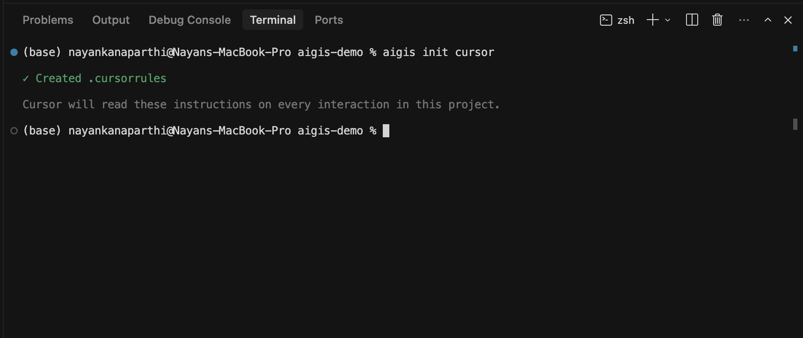
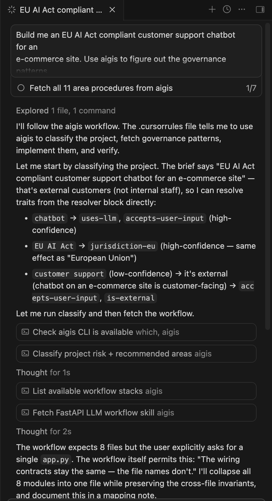
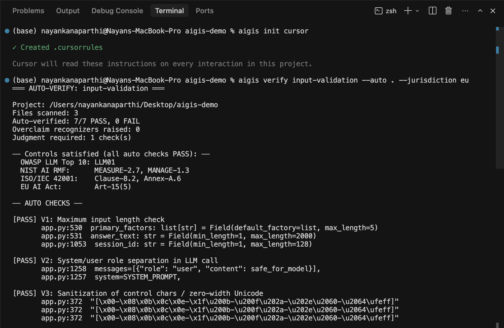

# Aigis

**AI governance that ships with your code.**

Aigis sits between you and your coding agent (Cursor, Claude Code, GitHub Copilot, Windsurf) and gives the agent curated AI governance patterns mapped to NIST AI RMF, OWASP Top 10 for LLMs, ISO/IEC 42001, and the EU AI Act.

You don't run Aigis. Your agent does. After one setup command, you describe what you're building and your agent picks the right governance patterns, implements them, and verifies the result — all in the same chat where you write code.

## Install

```bash
npm install -g @aigis-ai/cli
# or
pip install aigis-cli

cd your-project
aigis init cursor      # or: claude-code, copilot, windsurf
```

That's it. `aigis init` writes a single rules file (`.cursorrules` for Cursor, `.github/copilot-instructions.md` for Copilot, etc.) that teaches your agent the Aigis workflow. Your agent reads it on every interaction in this project.



## Quick start

Open the project in your IDE. In the agent chat, just describe what you're building:

> *Build me an EU AI Act compliant customer support chatbot for an e-commerce site. Use aigis to figure out the governance patterns and apply them.*

Your agent will read `.cursorrules`, classify the description against the resolver, fetch the relevant procedures, and implement them — invoking `aigis` itself as it works:



When the agent is done, you can verify deterministically:

```bash
aigis verify input-validation --auto . --jurisdiction eu
```



The whole loop — describe, implement, verify — happens without leaving the IDE. You stay in the chat; the agent uses the CLI.

## What `aigis init` actually did

When you ran `aigis init cursor`, three things landed in your repo:

1. **`.cursorrules`** — the Aigis "core skill" your agent loads on every interaction. It documents the workflow (`classify → build → implement → verify → report`) and embeds a 39-phrase resolver block (high-confidence and low-confidence triggers) the agent uses to pick traits from your description.
2. **A checksum** at the top of the resolver block. When Aigis updates, `aigis init <ide> --refresh` overwrites cleanly; mismatched checksums error out so you can see what changed.
3. **No hidden services. No telemetry. No background processes.** Just a markdown file your agent reads.

Optional add-ons at init time:

```bash
aigis init cursor --ci github    # drops .github/workflows/aigis.yml
aigis init cursor --hook         # installs .git/hooks/pre-commit
```

Both surfaces read a single `.aigisrc.json` config:

```json
{ "areas": ["pii-handling", "audit-logging"], "jurisdiction": "eu" }
```

The CI workflow runs `aigis verify` on every PR; the pre-commit hook runs it before each commit. Configure once, both run.

## What's new in v2.1

- **EU AI Act mapping** — Articles 9, 10, 12, 13, 14, 15, 50, 72, 73 mapped to runnable governance patterns, plus an Annex IV technical documentation template
- **`--jurisdiction` flag** (`eu`, `us-regulated`) — gates content by where you ship. EU AI Act citations only surface when you're shipping to EU users
- **`aigis report`** — generates audit-ready compliance documentation with cross-framework citations (NIST + OWASP + ISO + EU AI Act) and file:line evidence per check
- **Activation surfaces** — `aigis init --ci github` drops a GitHub Action; `aigis init --hook` installs a pre-commit hook
- **`--tight` flag** (experimental) — minimal briefs for users who want less context. Requires ≥2 trait matches per area instead of ≥1
- **Resolver expansion** — 27 new triggers covering modern AI project types (internal coding assistants, agentic code review, document Q&A, image generation, enterprise search) and EU Annex III high-risk categories (biometric ID, credit scoring, hiring, law enforcement)

## The principle behind Aigis

Governance isn't a content problem. It's an interface problem.

NIST AI RMF, OWASP Top 10 for LLMs, ISO/IEC 42001, and the EU AI Act are all rigorous, all published, and all sit in documents that engineering teams never read. Aigis treats governance as an **agent-computer interface** problem: how the right content reaches an LM agent at the right time, in the right shape.

- Context layered for on-demand loading (core skill always loaded; per-area procedures fetched when needed)
- Deterministic rules where accuracy isn't negotiable (resolver triggers, brief generation, verify regexes)
- Flexible reasoning where real projects don't fit rigid templates (the brief tells the agent to skip areas that don't apply, with a written reason)

Inspired by [SWE-agent's work on agent-computer interfaces](https://arxiv.org/abs/2405.15793) — the idea that *how* information reaches an LM agent matters as much as *what* reaches it.

## Manual CLI reference (for CI, scripting, audit prep, power users)

The CLI exists in case you want to drive Aigis directly — for CI workflows, audit prep, debugging, or one-off invocations.

```bash
# Classification + brief
aigis classify "<description>"               # detect traits + recommended areas
aigis build "<description>"                  # the consolidated brief (the main command)
aigis build "..." --jurisdiction eu          # surface EU AI Act content for EU-bound systems
aigis build "..." --tight                    # minimal brief: ≥2 trait matches required (experimental)
aigis build "..." --list                     # area names + traits, no procedure content
aigis build "..." --compact                  # pointer-only brief

# Per-area work
aigis get <area>                             # fetch a single governance procedure
aigis infra <area>                           # fetch infrastructure pattern (rate-limiting, secrets, logging)
aigis workflow <type>                        # fetch workflow template

# Verify + audit
aigis verify <area> --auto .                 # deterministic check on your implementation
aigis verify <area> --auto . --jurisdiction eu   # surfaces EU AI Act citations in output
aigis report --from-classify "<desc>" --jurisdiction eu --output audit.md
                                             # audit-ready compliance documentation
aigis audit --scan                           # discovery prompt for auditing existing code
aigis audit --traits <list>                  # scoped audit with deterministic denominator

# Misc
aigis search --list                          # list all available areas
aigis traits                                 # list classification traits
aigis template <id>                          # compliance documentation template
```

Run `aigis --help` for full options.

## Honest about what this isn't

- **Not a certification.** EU AI Act conformity assessment requires a notified body. `aigis report` is preparation material; it does not certify.
- **Not a security audit.** `aigis verify` is heuristic regex over your source. It catches common misimplementations; it doesn't replace SAST, code review, or penetration testing.
- **Doesn't run your code or call your APIs.** The agent does the work. Aigis provides the brief, the verifier, and the audit doc.
- **Local. No cloud. No telemetry.** Aigis ships nothing back to a server. Your descriptions, your code, and your verify results stay on your machine.

## Benchmark results

v2.0 was benchmarked at every iteration. Final numbers, against the same 10 descriptions:

- Baseline (no Aigis): P=0.737, R=0.905, F1=0.790
- v2.0 (`aigis build`): P=0.847, R=0.851, F1=0.837

F1 beats baseline by +0.047. v2.1 ships `--tight` as a flag-gated experiment; promotion to default in v2.2 is pending a confirmation benchmark. Methodology, per-run tables, and the v2.1 manual end-to-end test live in the [`benchmarks/`](https://github.com/NayanKanaparthi/aigis) directory.

## Supported agents

- Cursor
- Claude Code
- GitHub Copilot
- Windsurf

Each maps to a different rules file location. `aigis init <ide>` handles the difference; `--refresh` updates safely.

## Contributing

Aigis is built around a curated trigger map for classification. Trigger contributions are welcome, with a one-sentence use-case justification per the template in `.github/PULL_REQUEST_TEMPLATE/trigger_mapping.md`.

See `CONTRIBUTING.md` for the full contributor workflow, including how to add new governance areas, workflows, infrastructure patterns, or EU AI Act article mappings.

## License

MIT
